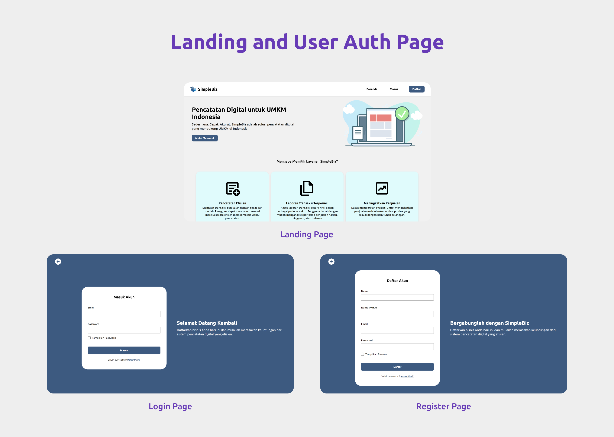
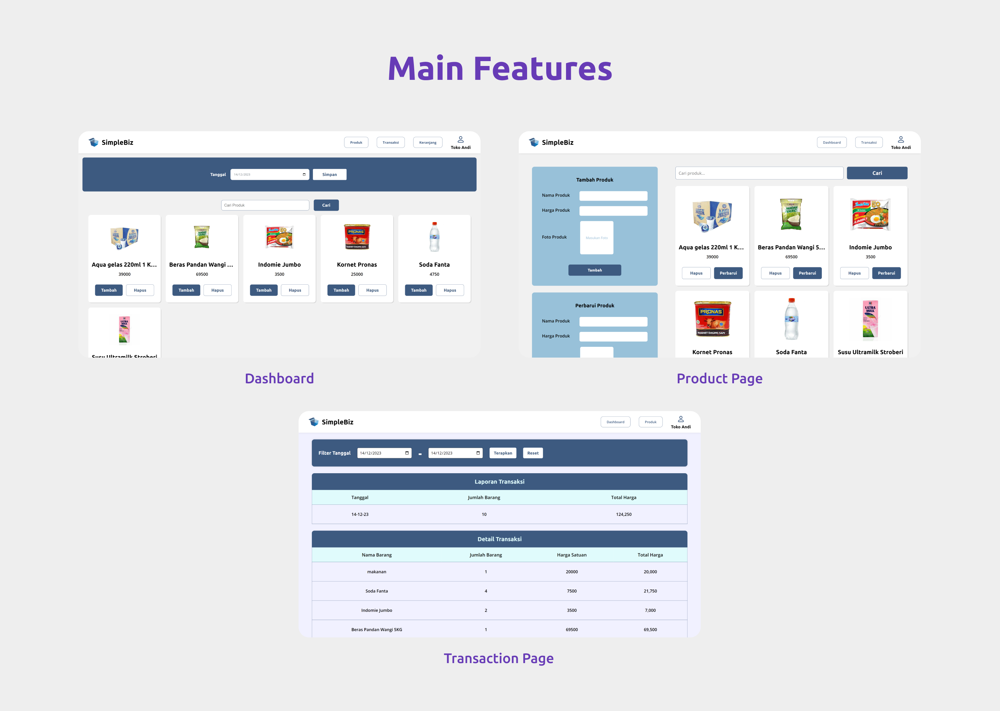
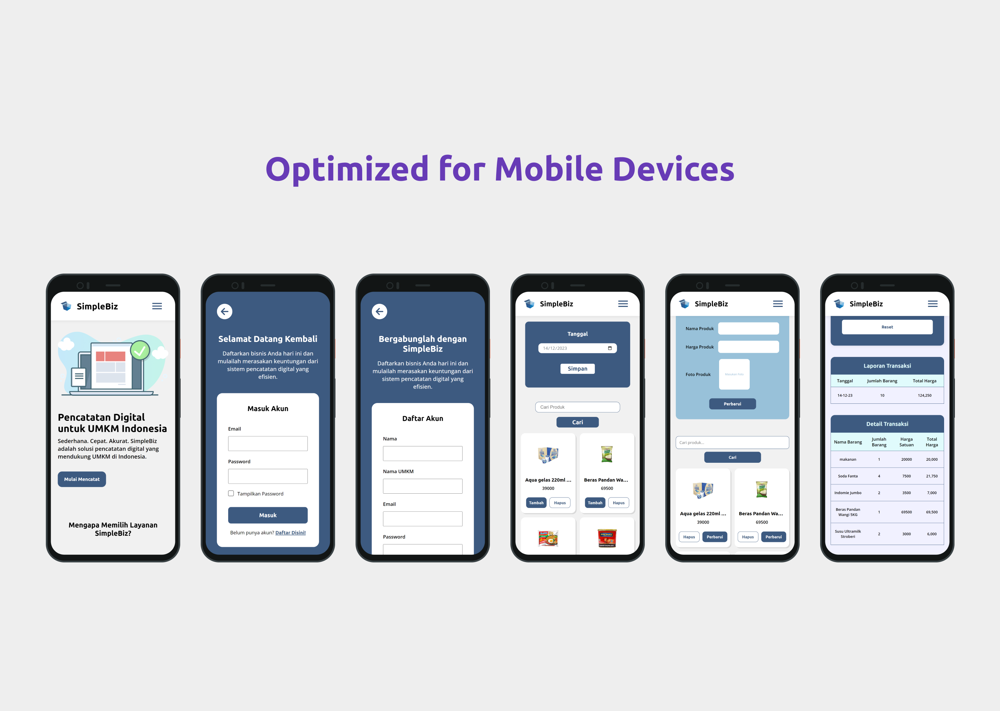

# SimpleBiz

## Introduction
SimpleBiz adalah aplikasi kasir berbasis website yang dirancang untuk mendukung Usaha Mikro, Kecil, dan Menengah (UMKM) di Indonesia dalam mengadopsi sistem pencatatan transaksi digital. Dengan menggunakan SimpleBiz, pelaku UMKM dapat memanfaatkan teknologi untuk meningkatkan efisiensi operasional, akurasi data, dan keamanan dalam mencatat setiap transaksi.
#
## Features
SimpleBiz menyediakan sejumlah fitur yang dirancang untuk memenuhi kebutuhan pelaku UMKM, antara lain:

1. Registrasi dan Login
Pengguna dapat mendaftarkan UMKM yang dimiliki dan login dengan akun UMKM tersebut.

2. Pengelolaan Produk
Pengguna dapat memasukkan produk dagangan serta data yang mencakup nama produk, harga produk, dan gambar produk. 
Pengguna juga dapat memperbarui data produk dan menghapus data produk jika diperlukan. 

3. Menampilkan Daftar Produk
Pengguna dapat melihat daftar produk dagangan yang dimiliki dan melakukan pencatatan transaksi yang dilakukan.
Dalam melakukan transaksi, pengguna juga dapat memasukkan nominal pembayaran yang diberikan pelanggan untuk memudahkan dalam menghitung kembalian.

4. Pencatatan Transaksi Penjualan
Pengguna dapat melakukan pencatatan setiap transaksi yang dilakukan secara otomatis dan akurat. 
Data pencatatan transaksi yang dilakukan di database  mencakup tanggal dilaksanakannya transaksi tersebut, nama-nama produk yang ditransaksikan pada tangggal tersebut,
dan harga dari setiap produk sekaligus total harga sesuai jumlah produk yang ditransaksikan.

5. Laporan Data dan Evaluasi Transaksi
Pengguna dapat melihat catatan transaksi yang dilakukan dalam rentang tanggal yang diinginkan dari tanggal awal hingga tanggal akhir yang diinginkan. 
Pengguna akan melihat catatan transaksi yang ditampilkan berdasarkan tanggal transaksi serta jumlah seluruh produk sekaligus jumlah seluruh harga dari produk yang ditransaksikan pada tanggal tersebut.
Pengguna juga dapat melihat detail dari transaksi yang dilakukan pada tanggal tertentu yang detailnya ditampilkan berdasarkan nama-nama produk serta jumlah produk, harga satuan produk, dan total harga dari produk tersebut.

#
## Resources Used
- NPM (Node Package Manager)
- Standard Web Development (Plain HTML, CSS, JS)
- Parcel (Module Bundler)
- ESLint (Code Linter)
- Firebase (Authentication, Firestore Database, Cloud Storage)
- Netlify (Deployment)
#

## Screenshots
### 1. Halaman Landing dan Auth

### 2. Halaman Fitur Utama

### 3. Tampilan Mobile

#
## Deployed App
📋 [Visit SimpleBiz](https://simplebiz.netlify.app/)

